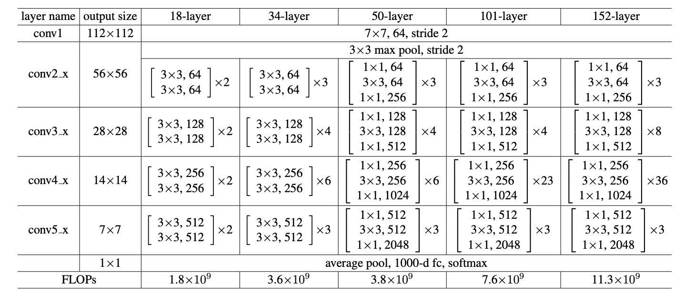
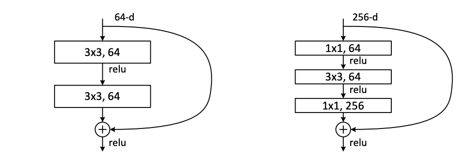

# ResNet
> Kaiming He, Xiangyu Zhang, Shaoqing Ren, Jian Sun

- [paper](https://arxiv.org/abs/1512.03385) 
- [official code](https://github.com/KaimingHe/deep-residual-networks)

- 模型结构(ResNet-34)
    
    
- 结构明细
    
    
- 核心思想
    - VGG等网络模型，随着网络层数的不断增加，其效果却变差了，主要问题在于：
        1. 梯度消失和梯度爆炸
        2. 退化问题(随着层数的增加，预测效果反而越来越差(包括训练和测试))
    - 解决思路：
        1. BN(Batch Normalization) 解决梯度爆炸&消失
        2. Residual结构 解决退化问题
        
- 两种残差结构

    
    - BasicBlock
    - Bottleneck
        > 1x1卷积对特征进行降维&升维，以减少卷积操作的参数量&计算量；深层网络中，一般使用Bottleneck
    
    - 降维时的 short cut
        - 通道数&特征图尺寸不变时，采用直连方式
        - 通道数x2 & 特征图尺寸/2时候，short cut进行了 步长为2的1x1卷积
        
